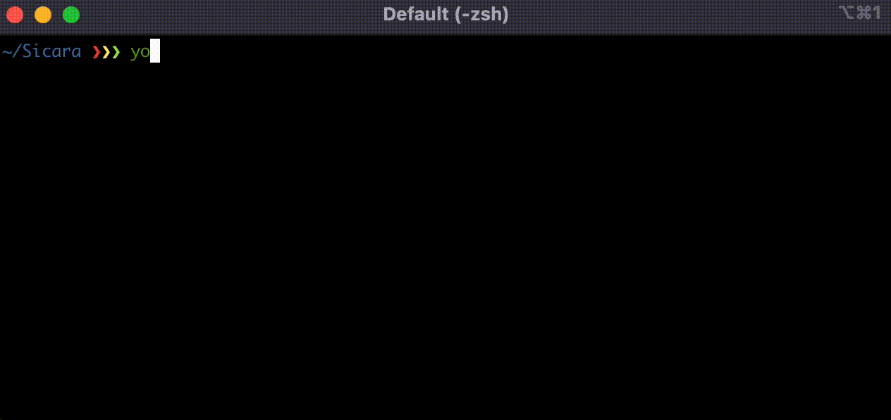

# Sicarator
> Instant Setup & Best Quality for Data Projects!

**Sicarator** is a **CLI generator** for **Data Science projects**. It is built with [Yeoman](https://yeoman.io/) and maintained by [Sicara](https://www.sicara.fr/).



## Main components of the generated project

- **Python** development environment with:
  - [Poetry](https://python-poetry.org/) for dependency management
  - [Pytest](https://docs.pytest.org/) for testing
  - [Black](https://black.readthedocs.io/) for code formatting
  - [Ruff](https://beta.ruff.rs/) for static analysis
  - [Mypy](https://mypy.readthedocs.io/) for type checking
  - [Pre-commit](https://pre-commit.com/) for git hooks
- **Continuous Integration** of your choice:
  - [CircleCI](https://circleci.com/)
  - [Github Actions](https://github.com/features/actions)
  - [Gitlab CI/CD](https://docs.gitlab.com/ee/ci/)
  - [Azure Pipelines](https://azure.microsoft.com/en-us/products/devops/pipelines/)
- *(optional)* **API**:
  - built with [FastAPI](https://fastapi.tiangolo.com/)
  - containerized with [Docker](https://www.docker.com/)
  - deployed on one of the following infrastructures:
    - [AWS](https://aws.amazon.com/) auto-scaled infrastructure (API Gateway, ASG, ECS, EC2)
    - [GCP](https://cloud.google.com/) serverless infrastructure (Cloud Run, Artifact Registry)
    - *more to come...*
  - provisioned with [Terraform](https://www.terraform.io/)
  - testable with a [Postman](https://www.postman.com/) collection
- *(optional)* **Data Versioning and Pipelines** with [DVC](https://dvc.org/)
- *(optional)* **Data Visualization** with [Streamlit](https://streamlit.io/)

## Requirements

### Pyenv

Install [pyenv](https://github.com/pyenv/pyenv) to manage your Python versions and virtual environments:
  ```bash
  curl -sSL https://pyenv.run | bash
  ```
*If you are on MacOS and experiencing errors on Python install with PyEnv, follow this [comment](https://github.com/pyenv/pyenv/issues/1740#issuecomment-738749988)*

### Poetry

Install [Poetry](https://python-poetry.org) to manage your dependencies and tooling configs:
  ```bash
  curl -sSL https://install.python-poetry.org | python - --version 1.7.0
  ```
*If you have not previously installed any Python version, you may need to install one and set it as your default Python version before installing Poetry:*
  ```bash
  pyenv install 3.10.6 # or any recent version
  pyenv global 3.10.6
  ```

### Node.js

Install a stable version of [Node.js](https://nodejs.org/) (v18.x.x) if you don't have one.
The Sicarator is indeed a [Yeoman](https://yeoman.io/) generator, which is a `Node.js` module.
    
For linux:
  ```bash
  curl -fsSL https://deb.nodesource.com/setup_18.x | sudo -E bash -
  sudo apt-get install -y nodejs
  ```

### Yeoman

Install [Yeoman](http://yeoman.io):
  ```bash
  npm install -g yo
  ```

## Usage

- Before generating a new project, make sure to install last version of `Sicarator` by re-running:
    ```bash
    npm install -g sicara/sicarator
    ```

- Generate a new project with:
    ```bash
    yo sicarator
    ```

## Troubleshooting

### I don't have the correct permissions to install yeoman
Example error:
    
```bash
npm ERR! code EACCES
npm ERR! syscall rename
npm ERR! path /usr/lib/node_modules/generator-sicarator
npm ERR! dest /usr/lib/node_modules/.generator-sicarator-cELCsz5l
npm ERR! errno -13
npm ERR! Error: EACCES: permission denied, rename '/usr/lib/node_modules/generator-sicarator' -> '/usr/lib/node_modules/.generator-sicarator-cELCsz5l'
...
```

Solution: give yourself the ownership of npm and node_modules :
```bash
sudo chown -R $(whoami) ~/.npm
sudo chown -R $(whoami) /usr/lib/node_modules # or /usr/local/lib/node_modules depending on where node modules are installed
```
### I have the correct git credentials, but installation is throwing a git error
Example error:
```bash
git@github.com: Permission denied (publickey).
fatal: Could not read from remote repository.
```

Solution: you are probably using `sudo` to run the installation, which doesn't use the same git credentials.
See solution above to install the project with your current user profile.

## Contribute to the project

### Install the project 

- Install the project with:
  ```bash
  git clone git@github.com:sicara/sicarator.git
  ```
  and install dependencies
  ```bash
  npm install
  ```
  
- To be able to run current dev version of the project, you can use the following command in your project directory:
  ```bash
  npm link
  ```
  - Next time you run `yo sicarator`, dev version will be used.
  - If you want to go back to the production version you can re-run:
    ```bash
    npm install -g sicara/sicarator
    ```

### Dev tools

- For debugging, you can run:
  ```bash
  npx --node-options="--inspect" yo sicarator
  ```

- To run the linter (eslint), you can use:
  ```bash
  npm run lint
  ```

- To run the tests, you can use:
  ```bash
  npm test
  ```
